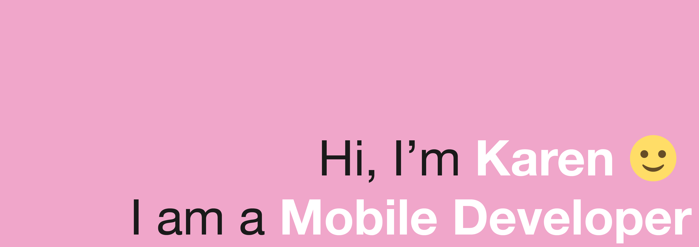

❤️ I am interested in mobile accessibility, UX, and creating visual experiences that users can enjoy.

👩🏻‍🏫 I am a mentor at work, and I regularly volunteer in STEM programs oriented towards minorities in tech. I also provide mentorship/tutoring services to individuals learning iOS development and general programming.

In my spare time, I engage in web development, learning React, Remix.js, Vue.js, Node.js, and similar technologies. Many of my repositories are related to these practices. I believe in the idea of open learning, sharing the process (including both the successes and mistakes), to gauge my personal growth. Prior to delving into the tech industry, I worked as a lawyer in Peru.

🌟🌟🌟 If you are interested in any of these topics or would like to chat about video games 🕹️, cooking 🥘, knitting 🧶, drawing 🎨, reading 📚, or design 🎭, feel free to reach out. 🌟🌟🌟

### Currently doing (May 10th, 2024)

- Algorithms and data structures review.
- Remix.

More on that, check my [TIL](https://github.com/Jadekin/TIL).
