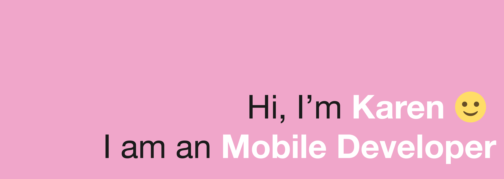

💻 Work at FreshBooks.

❤️ I am interested in mobile, accessibility, UX, and how to create visual experiences that users can enjoy.

👩🏻‍🏫 I am a mentor at work and I am a regular volunteer in STEM programs oriented to minorities in tech. I also provide services of mentorship/tutoring to people who are learning iOS development and general programming.

I am doing some web development in my spare time, learning React, Remix.js, Vue.js, Node.js and such, so many of my repos are related to this practices. I believe in this idea of open learning, share the process (the good things and the mistakes), to be able to compare me just with myself. Before all this tech, I was a lawyer in Peru.

🌟 🌟 🌟 If you are interested in any of those topics or do you want to chat about video games 🕹️, cooking 🥘, knitting 🧶, drawing 🎨, reading 📚 or design 🎭, hmu 🌟 🌟 🌟
